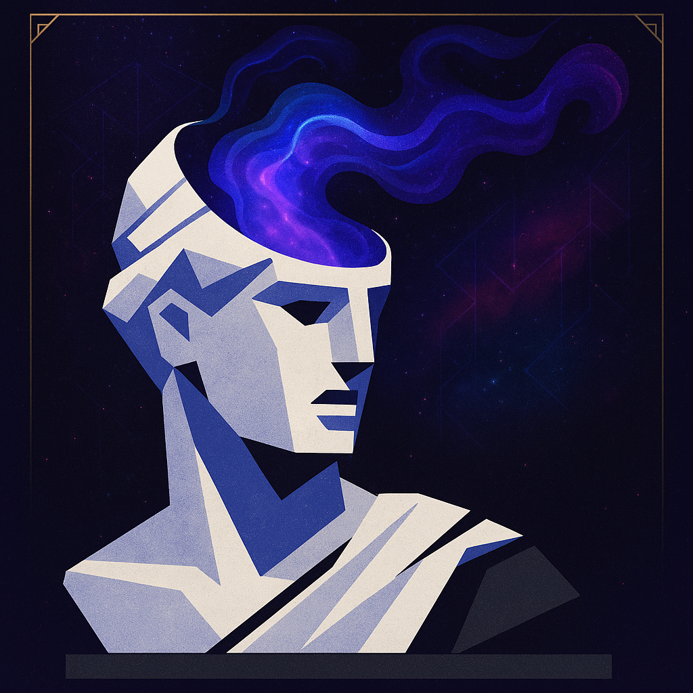

# Dreams.ai

## Project Overview
Dreams.ai is a platform for generating dynamic, interactive narrative experiences. Users provide a prompt, and a network of AI agents (Carthir, Narnion, and others) collaboratively generate a personalized story, stored as a `.imn` imagination file. The frontend offers a visually rich, immersive experience, while the backend orchestrates narrative generation and user management.

---

## Technology Stack
- **Backend:** Python 3.13, FastAPI, LangGraph, LangChain, Pydantic, Uvicorn
- **Frontend:** React, Vite, TypeScript, TailwindCSS
- **Database/Auth/Storage:** Supabase (Postgres, Auth, Storage)
- **Other:** @supabase/supabase-js, Lucide React Icons

---

## Directory Structure
```
Dreams.ai/
├── Backend/
│   ├── Python/           # FastAPI server, LangGraph pipeline, requirements
│   ├── Dreams/           # Generated .imn imagination files
│   └── Scoping/          # Project breakdown, schema docs
├── src/                  # Frontend React app
│   ├── components/       # UI components (auth, feed, profile, etc.)
│   ├── pages/            # Main pages (Feed, Login, Register, etc.)
│   └── lib/              # Supabase client and helpers
├── supabase/             # Database migrations
├── package.json          # Frontend dependencies/scripts
├── README.md             # (This file)
└── ...
```

---

## Backend (API Server)
- **Location:** `Backend/Python/`
- **Main entry:** `api_server.py` (FastAPI app)
- **LangGraph pipeline:** `main.py` (handles prompt-to-story pipeline, .imn file creation)
- **Dependencies:** See `requirements.txt` and `pyproject.toml`

### How to Start the Backend Server
1. **Install Python 3.13+** and dependencies:
   ```sh
   cd Backend/Python
   pip install -r requirements.txt
   ```
2. **Start the server:**
   - On Windows, run:
     ```sh
     ../start_api_server.bat
     ```
   - Or manually:
     ```sh
     python3.13 -m uvicorn api_server:app --reload
     ```
3. **API Endpoint:**
   - `POST /api/dream` — Accepts `{ "prompt": "your story idea" }`, returns generated dream info and .imn file path.

---

## Frontend (React App)
- **Location:** `src/`
- **Entry:** `src/main.tsx`, `src/App.tsx`
- **Features:**
  - Dream prompt input and result display
  - User authentication (Supabase)
  - Profile management
  - Dream feed, trending, collections

### How to Start the Frontend
1. **Install Node.js (18+)**
2. **Install dependencies:**
   ```sh
   npm install
   ```
3. **Start the dev server:**
   ```sh
   npm run dev
   ```
4. **Configure environment variables:**
   - Create a `.env` file with your Supabase project keys:
     ```env
     VITE_SUPABASE_URL=your-supabase-url
     VITE_SUPABASE_ANON_KEY=your-anon-key
     ```

---

## Database (Supabase)
- **Migration:** `supabase/migrations/20250630021452_foggy_sunset.sql`
- **Main table:** `profiles` (user info, bio, profile picture, etc.)
- **Storage:** `profile-pictures` bucket for user avatars
- **Policies:** Row-level security for user data

---

## .imn File Format (Imagination File)
Example (`Backend/Scoping/schema.imn`):
```json
{
  "dream_name": "The Princess Rescue",
  "user_prompt": "rescue a princess from a castle",
  "story_prompt": "You are a brave knight navigating through an ancient Castle Drakon to rescue Princess Aurelia from the clutches of the fearsome dragon, Ignis. The castle is riddled with traps and guarded by enchanted creatures.",
  "dream_tone": "Epic Fantasy",
  "actionable_goal": "Reach the princess and defeat the dragon.",
  "characters": ["Princess Aurelia", "Ignis"],
  "locations": ["Castle Drakon", "Dragon's Lair"],
  "plot_points": ["Navigate the castle's traps", "Defeat the enchanted creatures", "Confront Ignis"],
  "video_generation_prompt": "Dragon's Lair style, You are a brave knight facing a dragon",
  "camera_angles": ["low angle, hero shot", "tracking shot", "aerial view"],
  "scene_transitions": ["fade in", "wipe", "dissolve"],
  "created_by": "User"
}
```

---

## Branding & Logo
A project logo is available at:

```
public/logo.png
```

You can use this logo for:
- Deployment splash screens
- Social media or marketing materials
- Favicon or web app manifest
- README or documentation branding

To display the logo in Markdown:

```markdown

```

Or in HTML:

```html

```

---

## Contributing
Pull requests and issues are welcome! Please see the code and documentation for details on the agent workflow and file formats.

## License
Specify your license here (e.g., MIT, Apache 2.0, etc.) 