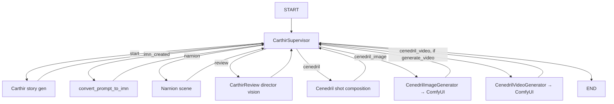

# Pipeline

The narrative + visual generation runs as a single LangGraph `StateGraph`, compiled and invoked per dream by [`PipelineInstance`](../../Backend/Python/core/pipeline_instance.py). All agents share one mutable `State` dict and a single `.imn` file on disk.

## The graph

Despite the "supervisor" framing, this is a **sequential** pipeline. Every node returns control to `CarthirSupervisor`, which advances a `pipeline_step` string and routes to the next node. There is no actual parallelism in the current graph (the module docstring's "native parallelization" is aspirational).

`pipeline_step` progression in `CarthirSupervisor` (`agents.py:742`):
`start` → (Carthir runs) → `imn_created` → `narnion_complete` → `review_complete` → `cenedril_complete` → `cenedril_image_complete` → `cenedril_video_complete` → `END`.

## The agents

| Node | Fn (`agents.py`) | Reads | Writes | LLM? |
| --- | --- | --- | --- | --- |
| **Carthir** (story) | `Carthir` (114) via `CarthirSupervisor` | user prompt | `carthir_memory`: `dream_name`, `story_prompt`, `initial_goal`, `pitch` | yes |
| **convert_prompt_to_imn** | `convert_prompt_to_imn` (60) | `carthir_memory` | creates `<id>.imn` in `../Dreams` | no |
| **Narnion** (scenes) | `Narnion` (323) | `.imn` | appends a scene to `in_production` (context + 3 actions) | yes |
| **CarthirReview** (director) | `CarthirReview` (213) | `.imn` | `pre_production.director_vision` (vision, image_prompt, visual_notes, criteria) | yes |
| **Cenedril** (cinematographer) | `Cenedril` (389) | `.imn` | `pre_production.cenedril_shot_composition` (the SDXL/Flux prompt) | yes |
| **CenedrilImageGenerator** | `CenedrilImageGenerator` (571) | `cenedril_shot_composition` | `post_production.image_generation` via ComfyUI | no (ComfyUI) |
| **CenedrilVideoGenerator** | `CenedrilVideoGenerator` (649) | image asset + prompt | `post_production.video_generation` via ComfyUI | no (ComfyUI) |

- **LLM access:** all narrative agents call `get_llm()` (`agents.py:36`), which returns the singleton `ModelManager` Llama-3.1 8B instance.
- **Cenedril vs CenedrilImageGenerator:** Cenedril only *authors the prompt*; the ImageGenerator node actually calls ComfyUI. Before that node existed (added 2026-05-20) Cenedril's prompt was orphaned. See [visual-generation.md](visual-generation.md).
- **Video gating:** `CenedrilVideoGenerator` no-ops unless `state["generate_video"]`. `state["video_cinematic"]` picks Wan2.2 over the default LTX-Video.
- **Failure handling:** visual agents record `status: "failed"` in the `.imn` and continue — they do **not** raise. The pipeline "completes" even when image/video fail. Cenedril (the prompt author) *does* raise on missing data, which would abort the run.

## State

`State` (`agents.py:44`) is a `TypedDict`. Key fields: `id`, `messages`, `carthir_memory`, `pipeline_step`, `generate_video`, `video_cinematic`. Several use `last_value` reducers so the supervisor's `Command(update=...)` writes win.

## Verified behavior (2026-05-23 end-to-end run)

A `POST /api/dream` with the "enchanted forest" prompt produced a complete, coherent narrative `.imn` in **~11.6 s** (4 LLM calls): dream name, pitch, one scene with 3 actions, director vision, and a first-person Cenedril shot composition. The image stage failed at ComfyUI (no checkpoint registered) and video was skipped. Details and open bugs: [operations/status-and-roadmap.md](../operations/status-and-roadmap.md).

## Gotchas

- **Preload only the LLM.** `PipelineInstance._preload_models()` → `ModelManager.preload_for_pipeline()`. Preloading the in-process diffusers SDXL pipelines here OOM-segfaults the GPU; that path was removed. Images/video go through ComfyUI.
- **Emoji prints need UTF-8 stdout.** Agents print emoji; on a Windows cp1252 console this raises `UnicodeEncodeError` and 500s the request. Launch uvicorn with `PYTHONIOENCODING=utf-8` (and `PYTHONUTF8=1`).
- **`.imn` write vs API read path differ.** Agents write `../Dreams` (= `Backend/Dreams`); `api_server` reads `Backend/Dreams` relative to cwd (= `Backend/Python/Backend/Dreams`). `GET /api/dreams/{id}` 404s for new dreams. See status doc.
